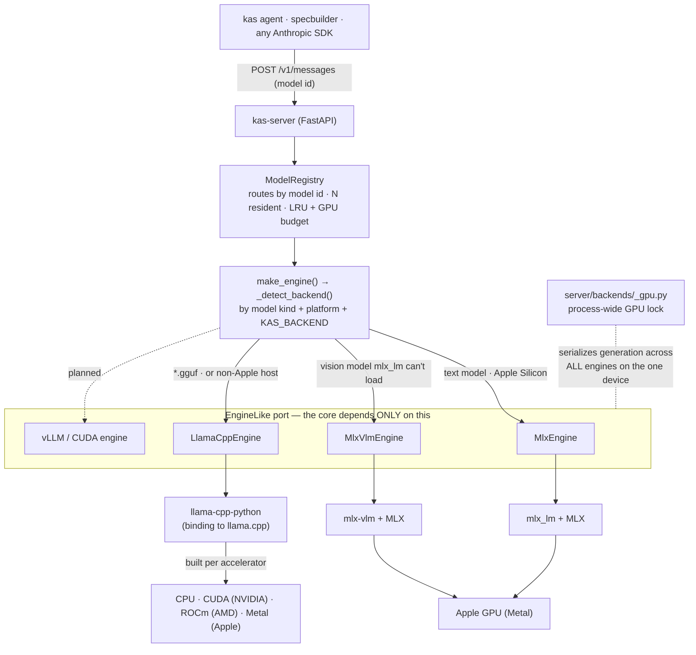

# Inference backends

kas is **hexagonal**: the server core (request translation, KV continuation, SSE
framing) depends on **one port** — the `EngineLike` Protocol in
`server/core/ports.py` — and never on a concrete runtime. A *backend* is any class
that satisfies that port. Swapping MLX for llama.cpp (or a future vLLM) changes
nothing in the core.

## The set today

| Backend (`server/backends/…`) | Runtime | Models | Hardware |
|---|---|---|---|
| **`mlx`** (`mlx.py`) | `mlx_lm` | text LLMs | Apple Silicon GPU (Metal) |
| **`mlx_vlm`** (`mlx_vlm.py`) | `mlx-vlm` | vision-language (image→text) | Apple Silicon GPU (Metal) |
| **`llama_cpp`** (`llama_cpp.py`) | `llama-cpp-python` → llama.cpp | **GGUF** (any family) | CPU · CUDA · ROCm · Metal |
| *`vllm` / CUDA* | — | — | **planned**, not built yet |

A couple of naming clarifications, since they're easy to mix up:

- There is **no "vLLM" backend yet** — it's a planned seam (you'll see it noted in
  `_detect_backend` and the README matrix). The three above are what exist.
- **`mlx-vlm`** (the vision backend) is *not* vLLM. It's MLX's vision-language
  stack — same MLX/Metal runtime as `mlx`, but it fuses image patches with text.
- **`llama-cpp-python`** is the **Python binding** to **llama.cpp** (a C++ engine).
  It's the cross-platform path: the *same* Python package is **compiled against a
  different accelerator** (CPU / CUDA / ROCm / Metal) depending on build flags.
  That build is what `scripts/install_deps.py` handles per-accelerator.

## How a request reaches a backend

## What the port requires

Every backend implements `EngineLike` (`server/core/ports.py`):

- **inference** — `tokenize()`, `encode()`, a streaming `generate()` yielding
  `GenChunk`s, plus the `model_id` / `dialect` / `stats` attributes;
- **management** — `swap()`, `request_cancel()`, `ping_status()`;
- **optional** — `cache_snapshot()` / `rehydrate()` (KV-resume) and
  `continuation_tail()` (append-only KV reuse). Backends that can't do these omit
  them and the core degrades — e.g. the VLM engine has no KV-resume.

## How `_detect_backend` chooses

In order (`server/backends/__init__.py`):

1. **`KAS_BACKEND`** env, if set, wins outright.
2. **GGUF** model id (`*.gguf` / "gguf") → `llama_cpp`.
3. **Vision** model (config has `vision_config`) on Apple Silicon → `mlx_vlm`,
   **unless** mlx_lm supports its text architecture (`_mlx_lm_supports`), in which
   case the mature, stable **text** engine (`mlx`) is used — text is the common
   case and mlx-vlm is shakier on some newer MoE+vision archs.
4. **Apple Silicon** → `mlx` (text).
5. Otherwise → `mlx` (so `make_engine` raises a clear "not supported on this host"
   rather than guessing) — until a CUDA/vLLM backend lands here.

Registration is gated twice: `supported()` (right OS/arch — MLX is Apple-only) and
`installed()` (the package is present). An unsupported/absent backend is skipped
with a clear message, never a deep `ImportError`.

## One GPU, one lock

There is a single Metal/CUDA device. Each engine runs GPU work on its own thread
(MLX's worker; the VLM/llama.cpp engines in the request threadpool), so without a
shared lock two of them could submit overlapping command buffers and trip the GPU
watchdog (→ a whole-process abort). `server/backends/_gpu.py` holds a process-wide
lock for the duration of each generation, shared by **all** backends, so GPU work
serializes (requests queue rather than crash). `KAS_GPU_SERIALIZE=0` opts out.

## Installing the right llama.cpp build

A plain `pip install llama-cpp-python` is **CPU-only** — on an NVIDIA box the GPU
sits idle. `scripts/install_deps.py` owns the per-accelerator build, one function
each (`install_deps_cuda` / `_rocm` / `_cpu`; Apple uses MLX, so it's skipped):

- **CUDA** — try abetlen's **prebuilt wheel** first (seconds), verify it really
  links `libggml-cuda.so`, else **source-build** with `CMAKE_ARGS=-DGGML_CUDA=on`.
- **ROCm** — source build with `-DGGML_HIP=on`.
- The shared gotcha it encodes: **uv caches the built wheel by sdist hash and
  ignores `CMAKE_ARGS`**, so a GPU switch must clear the cache + force `--no-binary`,
  or it silently reuses a CPU build.

`install.sh` runs this automatically on non-Apple hosts; `KAS_BACKEND` /
`KAS_GPU_LAYERS` / `KAS_GGUF_FILE` tune backend, GPU offload, and quant selection.
