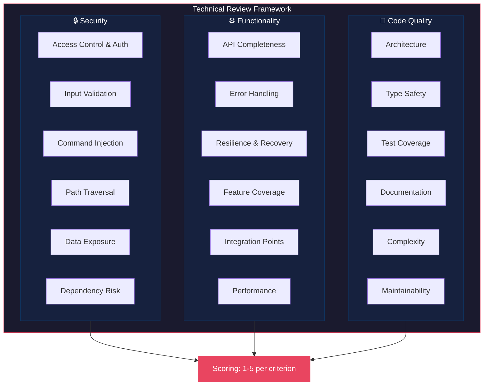
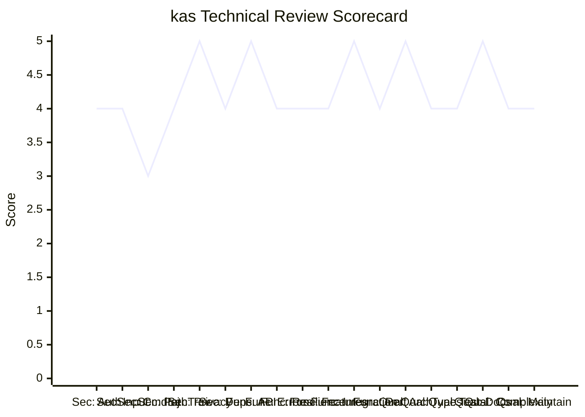

# Technical Review Framework

> A structured methodology for evaluating software projects across Security,
> Functionality, and Code Quality dimensions. Applied to the **kas** codebase
> (Kasra's Agentic Shell) in the sibling assessment reports.

---

## 1. Framework Overview

Each dimension is scored on a **1–5 scale**:

| Score | Rating | Meaning |
|-------|--------|---------|
| 5 | Excellent | Production-grade, no significant gaps |
| 4 | Good | Solid implementation, minor improvements possible |
| 3 | Adequate | Functional but with notable gaps |
| 2 | Needs Work | Significant deficiencies present |
| 1 | Critical | Unacceptable risk/deficiency |

---

## 2. Security Dimension (6 criteria)

### 2.1 Access Control & Authentication

**What to evaluate:**
- Does the server require authentication for sensitive endpoints?
- Is the attack surface limited to localhost by default?
- Are there secrets or keys exposed in logs/config?

**Key questions:**
- Can unauthenticated callers invoke destructive operations?
- Is model hot-swapping protected?
- Are session identifiers predictable?

### 2.2 Input Validation

**What to evaluate:**
- Are all external inputs validated before processing?
- Does the API reject malformed requests with clear errors?
- Are tool inputs sanitized before execution?

**Key questions:**
- Can a malicious prompt cause system-level harm?
- Are request sizes bounded?
- Does the schema layer catch edge cases?

### 2.3 Command Injection Prevention

**What to evaluate:**
- How are shell commands constructed and executed?
- Is user/agent input properly escaped in shell contexts?
- Does the PTY-based execution provide isolation?

**Key questions:**
- Can the agent be prompted to run destructive commands?
- Is the `--yolo` mode's risk surface understood?
- Does `--sandbox` effectively contain file operations?

### 2.4 Path Traversal Protection

**What to evaluate:**
- Do file operations resolve paths before access?
- Is the sandbox mode effective against `..` escapes?
- Are absolute paths handled consistently?

**Key questions:**
- Can prompt injection lead to reading `/etc/passwd`?
- Does the `PathResolver` cover all file tool entry points?

### 2.5 Data Exposure & Privacy

**What to evaluate:**
- What data leaves the machine (if anything)?
- Are session transcripts stored securely?
- Is telemetry absent (as advertised)?

**Key questions:**
- Does the `--net` flag properly gate external requests?
- Are compaction archives accessible to unintended parties?

### 2.6 Dependency Risk

**What to evaluate:**
- Are dependencies pinned and from trusted sources?
- Do optional extras have proper fallback paths?
- Is the supply chain attack surface minimized?

**Key questions:**
- What happens when an optional dependency is missing?
- Are there any known-vulnerable packages?

---

## 3. Functionality Dimension (6 criteria)

### 3.1 API Completeness

**What to evaluate:**
- Does the Anthropic Messages API surface cover the needed subset?
- Are streaming and non-streaming paths both implemented?
- Do SSE events match the Anthropic wire format?

**Key questions:**
- Can the official Anthropic SDK connect without modification?
- Are tool-use, thinking, and text all properly streamed?

### 3.2 Error Handling

**What to evaluate:**
- Are errors caught and surfaced gracefully at every layer?
- Do failures produce actionable messages for the model/user?
- Is there a consistent error envelope format?

**Key questions:**
- Does a crashed tool kill the agent loop?
- Are HTTP errors properly wrapped for the SSE stream?

### 3.3 Resilience & Recovery

**What to evaluate:**
- Can the system recover from dropped connections?
- Does compaction prevent context overflow crashes?
- Is state persistence (KV cache, sessions) reliable?

**Key questions:**
- What happens when the server dies mid-stream?
- Can sessions be resumed after a crash?

### 3.4 Feature Coverage

**What to evaluate:**
- Are all advertised features (subagents, recall, yolo, pause/resume)
  fully implemented?
- Do optional features (web, art) degrade gracefully?

**Key questions:**
- Is the TUI feature set complete vs the README claims?
- Are opt-in backends properly gated?

### 3.5 Integration Points

**What to evaluate:**
- How clean are the boundaries between agent ↔ server ↔ model?
- Is the hexagonal architecture properly enforced?
- Are protocol contracts stable?

**Key questions:**
- Can the agent run without a local server (remote `--base-url`)?
- Does the engine abstraction allow model swapping?

### 3.6 Performance

**What to evaluate:**
- Is KV cache reuse effective (continuation path)?
- Does the decode-speed compaction valve work?
- Are there memory leaks or unbounded buffers?

**Key questions:**
- Does prefill cost stay constant across turns?
- Is the per-thread KV cache properly LRU-bounded?

---

## 4. Code Quality Dimension (6 criteria)

### 4.1 Architecture

**What to evaluate:**
- Is the hexagonal (ports/adapters) pattern consistently applied?
- Are concerns properly separated (core vs adapter vs composition)?
- Is there circular dependency risk?

**Key questions:**
- Can core logic be unit-tested without heavy dependencies?
- Is the module hierarchy clean and navigable?

### 4.2 Type Safety

**What to evaluate:**
- Are type hints used consistently across the codebase?
- Are Protocol/ABC interfaces used for abstractions?
- Is Pydantic validation applied to all external inputs?

**Key questions:**
- Are there any `Any` types that should be more specific?
- Does the type system catch common bugs at development time?

### 4.3 Test Coverage

**What to evaluate:**
- What percentage of code paths are covered by tests?
- Are both unit and integration tests present?
- Do tests run without requiring model weights or GPU?

**Key questions:**
- Can CI run the full suite on a CPU-only machine?
- Are edge cases (empty inputs, malformed data) tested?

### 4.4 Documentation

**What to evaluate:**
- Do modules have docstrings explaining their role?
- Are complex algorithms (continuation, compaction) documented?
- Is the README comprehensive and accurate?

**Key questions:**
- Can a new contributor understand the architecture from docs?
- Are inline comments explaining the "why" not just the "what"?

### 4.5 Complexity

**What to evaluate:**
- Is cyclomatic complexity within reasonable bounds?
- Are there functions/methods that should be decomposed?
- Is the cognitive load of reading the code manageable?

**Key questions:**
- Does any single file exceed ~300 lines without clear structure?
- Are nested conditionals deep (>3 levels)?

### 4.6 Maintainability

**What to evaluate:**
- Is the codebase consistent in style and conventions?
- Are there build/test automation scripts?
- Is the refactoring history clean (git history)?

**Key questions:**
- Can a new feature be added without touching 10 files?
- Are there linting/formatting tooling configured?

---

## 5. Scoring Matrix

The final assessment produces a radar-style scorecard:

---

## 6. Usage

This framework is applied in the following assessment reports:

- **`security-assessment.md`** — Deep-dive on all 6 security criteria
- **`functionality-assessment.md`** — Evaluation of all 6 functionality criteria
- **`code-quality-assessment.md`** — Review of all 6 code quality criteria
- **`executive-summary.md`** — Consolidated scorecard with prioritized recommendations

Each report follows the same structure:
1. Criterion overview
2. Evidence from the codebase (file references, code snippets)
3. Score with justification
4. Recommendations (if score < 5)
