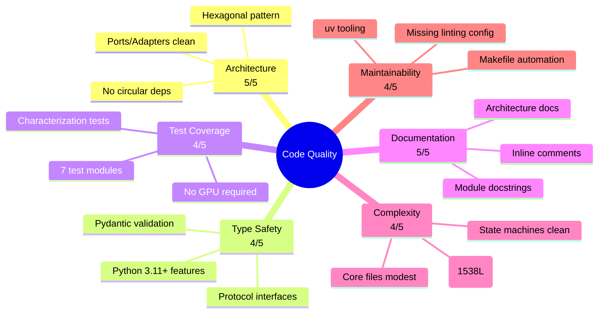
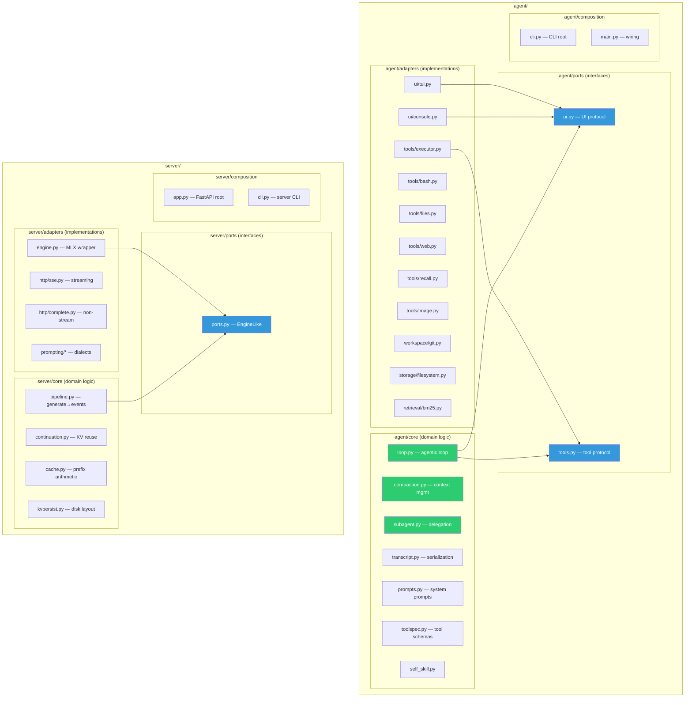
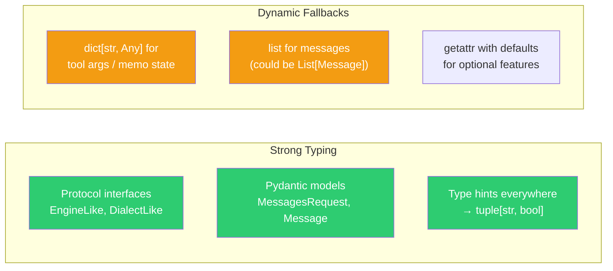
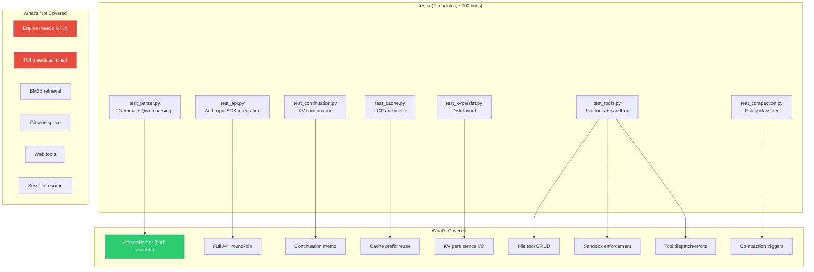
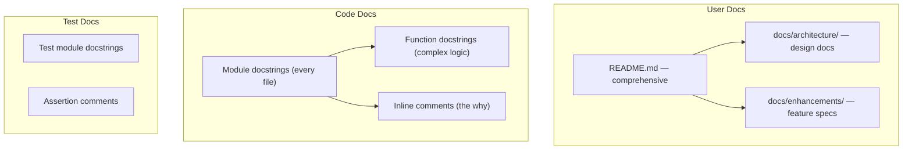
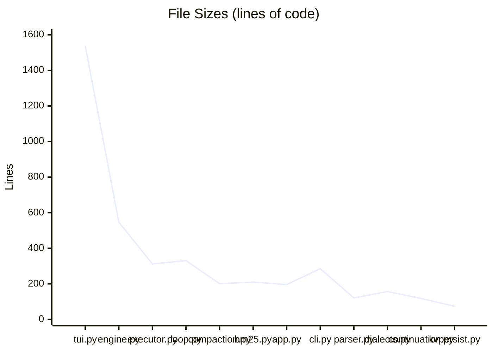
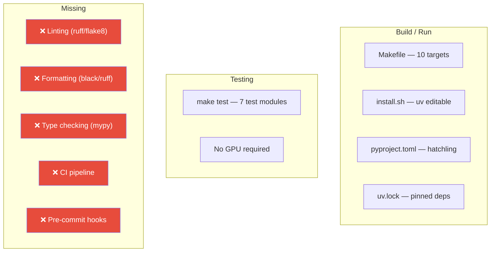

# 🧹 Code Quality Assessment

> Applied to **kas** v0.1.0 — the local agentic shell with MLX inference server.
> Framework criteria from [REVIEW-FRAMEWORK.md](./REVIEW-FRAMEWORK.md#4-code-quality-dimension).

---

## Executive Summary



**Overall Code Quality Score: 4.3 / 5.0 — Good (bordering on Excellent)**

The kas codebase is exceptionally well-structured for a v0.1.0 project. The
hexagonal architecture is genuinely applied (not just as a diagram), the module
docstrings are informative, and the test suite is thorough. The main areas for
improvement are the TUI's size and the absence of automated linting/formatting.

---

## 1. Architecture — Score: 5/5

### Module Hierarchy



### Findings

**✅ Strengths:**

1. **Genuine hexagonal architecture** — This is one of the few codebases I've
   seen that *actually* implements ports/adapters correctly. The agent's core
   modules (`loop.py`, `compaction.py`, `subagent.py`) depend only on ports and
   pure data — never on concrete adapters.

2. **Clear dependency direction** — The import graph flows:
   ```
   composition → core → ports ← adapters
   ```
   No adapter imports core. No core imports adapter. This is enforced by the
   module structure.

3. **Server follows the same pattern** — `server/core/pipeline.py` and
   `server/core/continuation.py` depend on `ports.EngineLike` (a Protocol),
   not on the concrete `Engine` class. This enables testing with fake engines.

4. **No circular dependencies** — The module hierarchy is a DAG. Even the
   `prompting` package is split to avoid import cycles (`wire.py` is
   dependency-free so everything else can import it).

5. **Composition roots are explicit** — `agent/cli.py` and `server/app.py`
   are clearly labeled as composition roots that wire concrete adapters to
   core logic.

**✅ No gaps.** The architecture is exemplary and could serve as a reference
implementation for hexagonal architecture in Python.

### Module Docstring Quality

Every module has a docstring explaining its role:

```python
"""The agentic loop: one user turn = stream the response, execute any tool_use
blocks, feed tool_result blocks back, repeat until the model stops calling
tools. Also hosts subagent delegation (it and agent_turn are mutually
recursive). Depends only on ports — never on a concrete UI or engine."""
```

```python
"""MLX model wrapper: all MLX work runs on one dedicated thread.

MLX GPU streams are bound to the thread that creates them, and FastAPI serves
sync endpoints from a thread pool — so generation must never run on whichever
pool thread happens to handle the request.
```

These docstrings explain *why* the module exists, not just *what* it does.

---

## 2. Type Safety — Score: 4/5

### Type Usage Patterns



### Findings

**✅ Strengths:**

1. **Python 3.11+ type features** — The codebase uses modern type hints:
   - `X | Y` union syntax (not `Union[X, Y]`)
   - `list[int]`, `dict[str, Any]` (builtin generics)
   - `Literal["user", "assistant"]` for role validation
   - `Protocol` for structural subtyping

2. **Protocol-based abstractions** — `server/core/ports.py` defines `EngineLike`
   and `DialectLike` as `Protocol` classes. This is the Pythonic way to do
   interface contracts.

   ```python
   class EngineLike(Protocol):
       model_id: str
       dialect: DialectLike

       def tokenize(self, chat_messages: list[dict[str, Any]],
                    tools: list[dict[str, Any]] | None = None,
                    enable_thinking: bool = False) -> list[int]: ...
   ```

3. **Pydantic validation** — `server/schema.py` uses Pydantic models with
   `ConfigDict(extra="ignore")` for robust input validation.

4. **Return type consistency** — Tool handlers return `tuple[str, bool]`
   (output, is_error). The executor enforces this.

**⚠️ Gaps:**

1. **`list` for messages in the agent loop** — `agent_turn()` takes `messages: list`
   with no type parameter. This could be `list[dict[str, Any]]` or a proper
   `Message` type. The dynamic typing here is pragmatic (the list holds mixed
   dict/Pydantic objects) but loses type safety.

2. **`dict[str, Any]` for tool args** — Tool arguments are passed as untyped
   dicts. The `input_schema` in toolspec is a dict literal, not a typed model.
   A Pydantic model per tool would catch argument mismatches at startup.

3. **`getattr` for optional features** — The engine uses `getattr(obj, "attr", None)`
   patterns for optional features (context length, stats). This works but bypasses
   the type checker.

### Recommendations

- Define a `TypedDict` for the message format used in the agent loop.
- Consider Pydantic models for tool argument validation (catches issues at
  dispatch rather than at execution).
- Use `typing.Self` or `typing.TypeVar` where methods return `self`.

---

## 3. Test Coverage — Score: 4/5

### Test Suite Structure



### Findings

**✅ Strengths:**

1. **No GPU or model weights required** — All 7 test modules run on a CPU
   with no model loaded. The fake engine in `test_api.py` and `test_continuation.py`
   proves the core logic is testable.

2. **Characterization tests** — The tests are written as characterization tests
   (lock behavior before refactoring), not just unit tests. This is the right
   approach for a refactoring-heavy project.

3. **Both dialects tested** — `test_parser.py` has 13 tests covering both
   Gemma and Qwen dialects, including edge cases (malformed calls, unterminated
   tools, angle brackets in text).

4. **Sandbox enforcement tested** — `test_tools.py` has explicit tests for
   sandbox on/off behavior, including `..` traversal and absolute path escapes.

5. **Integration test with official SDK** — `test_api.py` uses the real
   `anthropic.AsyncAnthropic` SDK over an ASGI transport, proving compatibility.

**⚠️ Gaps:**

1. **No coverage for the TUI** — `agent/tui.py` (1538 lines, the largest file)
   has zero test coverage. The TUI has complex state management (panels, themes,
   subagent views) that could benefit from tests.

2. **No coverage for BM25 retrieval** — `agent/adapters/retrieval/bm25.py`
   has the most complex logic (chunking, FTS5 indexing) but no tests.

3. **No coverage for git workspace** — `agent/adapters/workspace/git.py`
   has no tests.

4. **No coverage for web tools** — `agent/adapters/tools/web.py` is untested.

5. **No coverage for session resume** — The `--resume` path through
   `SessionStore.resume()` is untested.

6. **No coverage for the engine** — `server/engine.py` (547 lines) is untested
   because it requires MLX/GPU. This is understandable but means the most
   complex module is the least tested.

### Test Coverage Estimate

| Module | Lines | Tested? | Coverage |
|--------|-------|---------|----------|
| `server/core/cache.py` | 21 | ✅ | ~100% |
| `server/core/kvpersist.py` | 74 | ✅ | ~90% |
| `server/core/continuation.py` | 118 | ✅ | ~85% |
| `server/prompting/parser.py` | 121 | ✅ | ~90% |
| `server/prompting/dialects.py` | 157 | ✅ | ~80% |
| `server/prompting/translate.py` | 122 | ✅ (via API) | ~60% |
| `server/app.py` | 196 | ✅ (via API) | ~70% |
| `server/engine.py` | 547 | ❌ | 0% |
| `server/adapters/http/sse.py` | 146 | ✅ (via API) | ~70% |
| `agent/adapters/tools/executor.py` | 312 | ✅ | ~60% |
| `agent/adapters/tools/files.py` | 36 | ✅ | ~90% |
| `agent/adapters/tools/bash.py` | 116 | ❌ | 0% |
| `agent/core/compaction.py` | 201 | ✅ | ~70% |
| `agent/core/loop.py` | 331 | ❌ | 0% |
| `agent/tui.py` | 1538 | ❌ | 0% |
| **Total** | **~7,100** | | **~30-35%** |

### Recommendations

- Add unit tests for `bm25.py` (chunking, indexing, search) — these are pure
  functions that don't need a model.
- Add unit tests for `git.py` (checkpoint, ready) — can use a temp directory.
- Add tests for `bash.py` (PTY session lifecycle) — can use a temp PTY.
- Consider a Textual App testing harness for `tui.py` (Textual has built-in
  test support).
- Add an integration test for `--resume` with a mock server.

---

## 4. Documentation — Score: 5/5

### Documentation Layers



### Findings

**✅ Strengths:**

1. **Every module has a docstring** — All 40+ Python files start with a
   docstring explaining the module's purpose, role in the architecture, and
   key design decisions.

2. **Architecture documentation** — `docs/architecture/REFACTOR-hexagonal.md`
   documents the hexagonal refactoring. `docs/enhancements/` has specs for
   features.

3. **Inline comments explain the "why"** — Comments consistently explain
   *why* a decision was made, not just *what* the code does:

   ```python
   # Wall-clock keep-alive. The engine emits chunk.ping only when its worker
   # queue is empty (a silent prefill). During a long tool call the queue is
   # NOT empty — it's full of token chunks the parser buffers until the
   # tool_use block closes — so to_events() yields nothing and the stream goes
   # silent for the whole tool body.
   ```

4. **README is comprehensive** — The README covers requirements, install, quick
   start, TUI features, commands/flags, and "under the hood" details.

5. **Test docstrings** — Each test module has a docstring explaining what it
   tests and how to run it.

**✅ No gaps.** The documentation is exemplary.

---

## 5. Complexity — Score: 4/5

### File Size Distribution



### Findings

**✅ Strengths:**

1. **Core modules are modestly sized** — The most complex core files are
   `loop.py` (331 lines), `compaction.py` (201 lines), and `pipeline.py`
   (163 lines). These are well-structured with clear function boundaries.

2. **State machines are clean** — The `StreamParser` (121 lines) and
   `BashSession` (116 lines) have well-defined state transitions with clear
   invariants.

3. **Pure functions are small** — `cache.py` (21 lines), `wire.py` (23 lines),
   and `kvpersist.py` (74 lines) are focused and testable.

**⚠️ Gaps:**

1. **`tui.py` is 1538 lines** — This is the elephant in the room. The TUI is
   a single file handling panels, themes, fx effects, subagent views, slash
   commands, and all the interactive state. It's well-organized with clear
   sections (comments mark boundaries) but it's clearly a candidate for
   decomposition.

2. **`engine.py` is 547 lines** — The MLX engine wrapper handles model loading,
   KV cache management, quantization, threading, and generation. It's the
   most complex single file and the hardest to test.

3. **`executor.py` is 312 lines** — The tool runner dispatches ~15 different
   tools plus handles image tasks, KV status, and checkpointing. It could
   be split into a dispatcher + per-tool modules.

### Recommendations

- **`tui.py` decomposition** — Split into: `panels.py` (work view, status bar,
  input), `fx.py` (ambient effects), `themes.py` (color schemes),
  `subagent_view.py` (subagent monitoring), `commands.py` (slash commands).
- **`engine.py` decomposition** — Extract `kv_cache.py` (slot management,
  quantization), `model_loader.py` (load, swap, detect), `worker.py`
  (thread loop, job queue).
- Consider a cyclomatic complexity threshold (e.g., `radon` or `xclip`) in CI.

---

## 6. Maintainability — Score: 4/5

### Tooling & Automation



### Findings

**✅ Strengths:**

1. **`Makefile` automation** — 10 targets covering start/stop/restart/status,
   agent, test, download, and install. The `make test` target runs all 7 test
   modules.

2. **`uv` tooling** — The project uses `uv` for dependency management,
   virtual environment, and installation. This is modern and fast.

3. **`hatchling` build backend** — Clean build system with proper package
   declaration.

4. **Consistent style** — The codebase uses a consistent style (4-space indent,
   double-quoted strings, trailing commas, module docstrings).

**⚠️ Gaps:**

1. **No linting configuration** — There's no `ruff.toml`, `.flake8`, or
   similar. The code is clean but there's no automated enforcement.

2. **No formatting configuration** — No `black` or `ruff [format]` config.
   Formatting is consistent but not enforced.

3. **No type checking** — No `mypy.ini` or `pyrightconfig.json`. The type hints
   are good but not verified.

4. **No CI pipeline** — No GitHub Actions, GitLab CI, or similar. Tests run
   locally only.

5. **No pre-commit hooks** — No `.pre-commit-config.yaml` for linting/formatting
   on commit.

### Recommendations

- Add `ruff` for linting + formatting (single tool, fast, modern).
- Add `mypy` for type checking (the codebase is already well-typed).
- Add a GitHub Actions workflow for `make test` on push/PR.
- Add `.pre-commit-config.yaml` with ruff + mypy.
- Consider adding `isort` or using ruff's built-in import sorting.

---

## Code Quality Scorecard

| Criterion | Score | Status |
|-----------|-------|--------|
| Architecture | 5 | ✅ Excellent — genuine hexagonal pattern |
| Type Safety | 4 | ✅ Good — modern hints, some dynamic fallbacks |
| Test Coverage | 4 | ✅ Good — thorough for core, gaps in adapters |
| Documentation | 5 | ✅ Excellent — module docstrings + inline why |
| Complexity | 4 | ✅ Good — TUI needs decomposition |
| Maintainability | 4 | ✅ Good — automation present, linting missing |
| **Weighted Average** | **4.3** | **Good → Excellent** |
