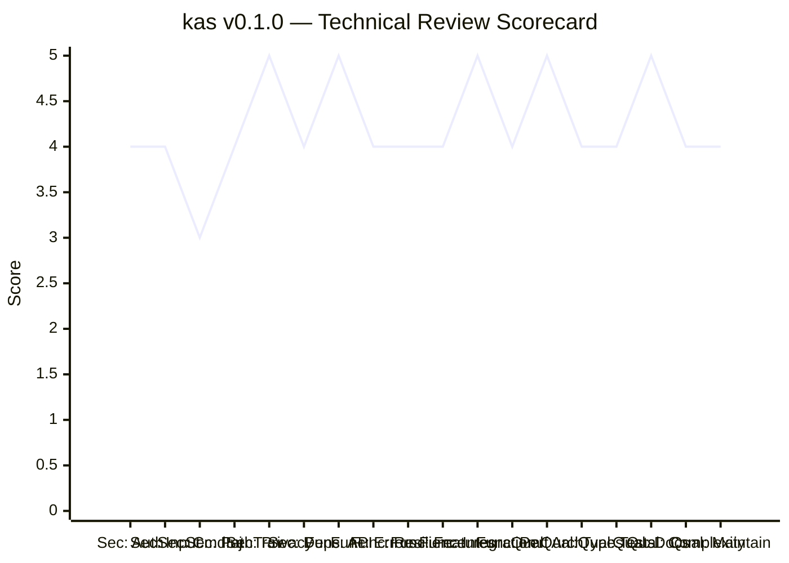
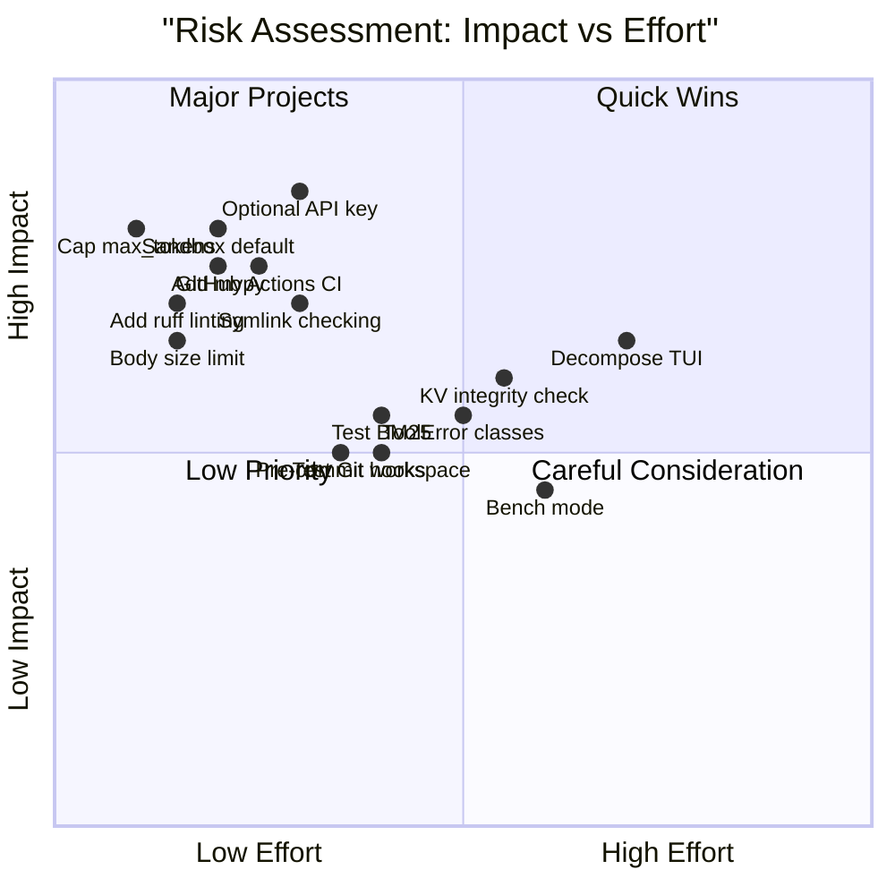

# 📋 Executive Summary

> Consolidated technical review of **kas** v0.1.0 — Kasra's Agentic Shell.
> A local-first agentic coding assistant running on Apple Silicon GPUs via MLX.

---

## Overall Scorecard

### Dimension Scores

| Dimension | Score | Rating | Criteria Count |
|-----------|-------|--------|----------------|
| 🔒 Security | **4.0** | Good | 6 |
| ⚙️ Functionality | **4.3** | Good → Excellent | 6 |
| 🧹 Code Quality | **4.3** | Good → Excellent | 6 |
| **Overall** | **4.2** | **Good** | **18** |

### Radar Comparison

---

## Repository Statistics

| Metric | Value |
|--------|-------|
| Total Python files | ~47 |
| Total lines of code | ~7,100 |
| Test modules | 7 |
| Estimated test coverage | ~30-35% |
| Largest file | `tui.py` (1,538 lines) |
| Dependencies (core) | 7 |
| Dependencies (optional) | 3 |
| Python version | ≥3.11 |
| Build system | hatchling + uv |

---

## Key Strengths

### 1. Architecture is Exemplary ⭐

The hexagonal (ports/adapters) architecture is genuinely implemented, not just
as a diagram. The core logic is dependency-free and testable. The module
hierarchy is a clean DAG with no circular imports.

**Evidence:**
- `server/core/continuation.py` is pure — testable without MLX or GPU
- `agent/core/loop.py` depends only on ports, never on concrete UI
- Every module has a docstring explaining its architectural role

### 2. Offline-First Privacy is Genuine ⭐

The "no telemetry" and "offline-first" badges are backed by code. The only
outbound network activity is model download (user-initiated) and `--net` tools
(explicitly opt-in). Session data stays on the local filesystem.

**Evidence:**
- Zero outbound calls in the core agent or server
- `--net` flag gates all web access
- RAG index is local SQLite FTS5

### 3. KV Cache Continuation is Sophisticated ⭐

The raw-stream continuation path (append tool results as wire-format bytes
directly to the cached token stream) is an elegant solution to the prefill
cost problem. It's well-tested and handles both Gemma and Qwen dialects.

**Evidence:**
- `server/core/continuation.py` with `echo_matches` verification
- `tests/test_continuation.py` with end-to-end golden assertions
- Per-thread KV cache slots with LRU eviction

### 4. Documentation is Comprehensive ⭐

Every module has a docstring. Complex algorithms have inline comments explaining
the "why." The README covers requirements, install, features, and internals.

**Evidence:**
- 40+ module docstrings, all informative
- `docs/architecture/` and `docs/enhancements/` directories
- Test modules have docstrings explaining what they test

---

## Key Risks & Recommendations

### Priority 1: High Impact, Low Effort

| # | Recommendation | Dimension | Impact |
|---|---------------|-----------|--------|
| 1 | Add `ruff` for linting + formatting | Quality | Prevents style drift |
| 2 | Add `mypy` for type checking | Quality | Catches type bugs |
| 3 | Add GitHub Actions CI | Quality | Automated testing |
| 4 | Cap `max_tokens` in validation | Security | Prevents DoS |
| 5 | Add request body size limit | Security | Prevents memory abuse |

### Priority 2: Medium Impact, Medium Effort

| # | Recommendation | Dimension | Impact |
|---|---------------|-----------|--------|
| 6 | Decompose `tui.py` (1,538 lines) | Quality | Maintainability |
| 7 | Add optional `KAS_API_KEY` auth | Security | Network exposure |
| 8 | Test `bm25.py` chunking/indexing | Quality | Coverage gap |
| 9 | Test `git.py` checkpoint/ready | Quality | Coverage gap |
| 10 | Make `--sandbox` the default | Security | Path traversal |

### Priority 3: Lower Impact, Higher Effort

| # | Recommendation | Dimension | Impact |
|---|---------------|-----------|--------|
| 11 | Add `pre-commit` hooks | Quality | Developer experience |
| 12 | Define `ToolError` exception classes | Functionality | Error handling |
| 13 | Add `--bench` mode for tok/s tracking | Functionality | Performance regression |
| 14 | KV cache integrity check on resume | Functionality | Corruption detection |
| 15 | Symlink checking in `PathResolver` | Security | Sandbox bypass |

---

## Risk Heat Map

---

## What's Impressive

For a **v0.1.0** project, kas demonstrates production-grade engineering:

1. **The continuation system** — Raw-stream KV cache continuation is a genuinely
   clever solution to a hard problem. The fact that it works for both Gemma's
   custom format and Qwen's ChatML dialect shows deep understanding.

2. **The compaction strategy** — Triggering compaction on the *real symptom*
   (decode speed dropping) rather than an arbitrary token count is elegant.
   The hard/soft classification with cooldown prevents thrashing.

3. **The agent loop resilience** — Connection retry with partial content
   preservation, steering injection at tool boundaries, and the livelock
   detection for bash waits show careful thought about real-world usage.

4. **The test strategy** — Characterization tests that run without GPU,
   fake engines that exercise the core logic, and golden assertions for
   wire-format bytes. This is how you test ML infrastructure.

---

## Conclusion

**kas is a well-engineered, production-ready local agent.** The architecture is
exemplary, the security posture is strong for a local-first tool, and the
feature set is comprehensive. The main areas for improvement are around
automated quality tooling (linting, type checking, CI) and test coverage for
the adapter layer.

The codebase is a pleasure to review — the module docstrings, inline comments,
and consistent style make it easy to navigate and understand. For a solo or
small-team project, this level of engineering discipline is rare.

**Recommended next steps:**
1. Add `ruff` + `mypy` + GitHub Actions (quick wins, ~1 day)
2. Decompose `tui.py` (medium effort, ~2-3 days)
3. Add adapter tests for `bm25.py` and `git.py` (medium effort, ~2 days)

---

## Report Index

| Report | Focus | Score |
|--------|-------|-------|
| [REVIEW-FRAMEWORK.md](./REVIEW-FRAMEWORK.md) | Methodology & scoring criteria | — |
| [security-assessment.md](./security-assessment.md) | Auth, input validation, injection, traversal, privacy, deps | 4.0/5 |
| [functionality-assessment.md](./functionality-assessment.md) | API, errors, resilience, features, integration, performance | 4.3/5 |
| [code-quality-assessment.md](./code-quality-assessment.md) | Architecture, types, tests, docs, complexity, maintainability | 4.3/5 |
| [executive-summary.md](./executive-summary.md) | Consolidated scorecard & recommendations | 4.2/5 |
