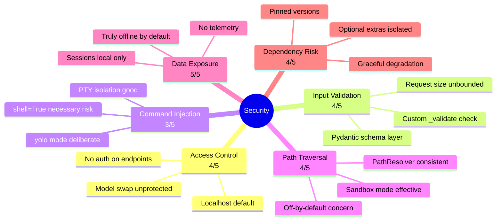
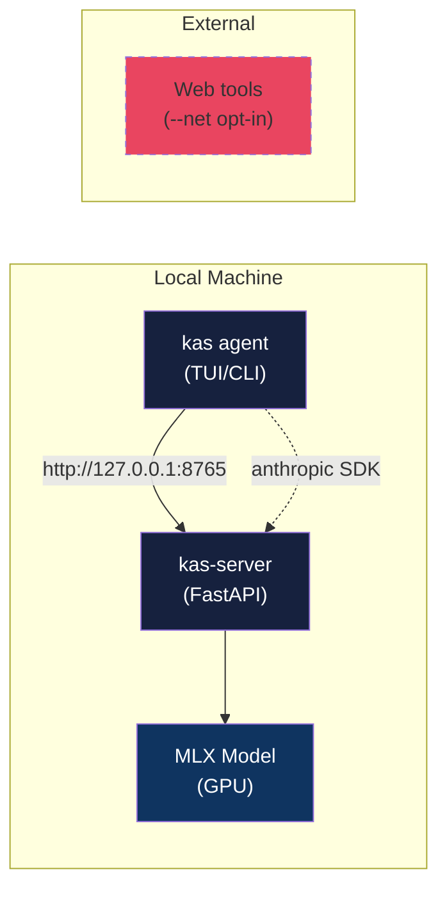
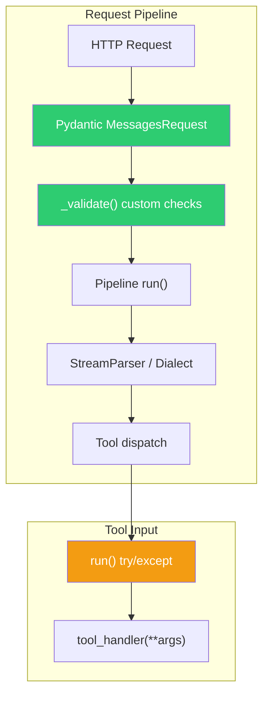
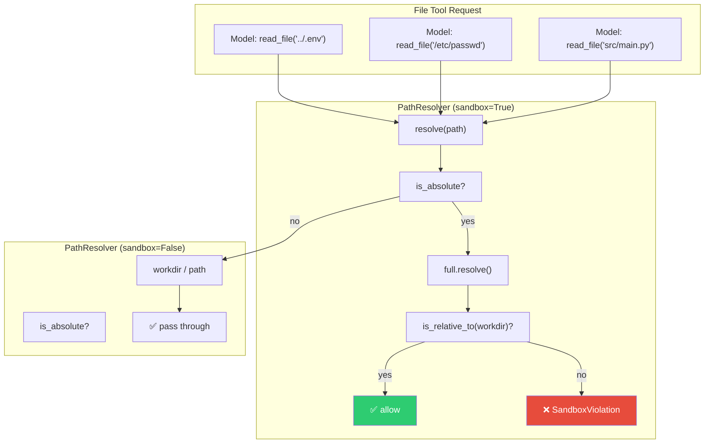
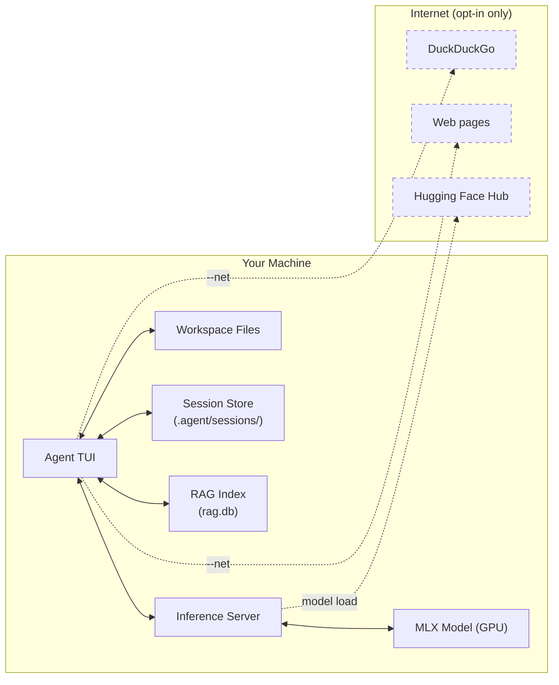
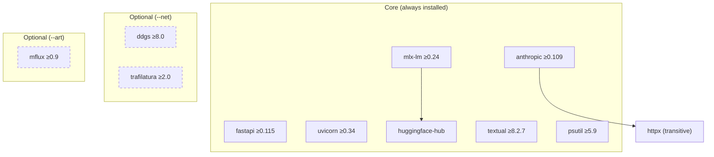

# 🔒 Security Assessment

> Applied to **kas** v0.1.0 — the local agentic shell with MLX inference server.
> Framework criteria from [REVIEW-FRAMEWORK.md](./REVIEW-FRAMEWORK.md#2-security-dimension).

---

## Executive Summary



**Overall Security Score: 4.0 / 5.0 — Good**

The kas codebase demonstrates strong security instincts for a local-first agent.
The `--sandbox` mode is well-implemented, the offline-by-default posture is
genuine, and input validation is thorough. The primary gap is the lack of
authentication on the inference server, which is mitigated by localhost-only
binding but would be a concern if exposed to a network.

---

## 1. Access Control & Authentication — Score: 4/5

### Architecture



### Findings

**✅ Strengths:**

1. **Localhost binding by default** — The server listens on `127.0.0.1:8765`
   (`server/cli.py`, `agent/config.py:BASE_URL`). This is the correct default
   for a local inference server.

2. **Anthropic SDK compatibility** — The client uses `api_key="local"` which
   is a non-secret constant. The server does not validate API keys, but since
   the server is localhost-only this is acceptable.

3. **Session isolation** — Each conversation thread (main agent + subagents)
   gets its own KV-cache slot (`server/app.py:_memos`), preventing cross-talk.

**⚠️ Gaps:**

1. **No authentication on any endpoint** — `server/app.py` has no middleware
   for auth. The `/v1/models/select` endpoint (hot-swap model), `/v1/cancel`
   (interrupt generation), and `/v1/messages` (run arbitrary code via tools)
   are all unprotected. If the server were bound to `0.0.0.0`, any LAN client
   could invoke these.

   ```python
   # server/app.py — no auth middleware
   @app.post("/v1/messages")
   def messages(req: MessagesRequest, request: Request):
       # directly processes the request
   ```

2. **Model swap is unprotected** — `POST /v1/models/select` lets any caller
   replace the loaded model. While this requires localhost access, it could
   be used for denial-of-service (loading a huge model) or prompt-injection
   (loading a compromised model from HF Hub).

3. **Cancel endpoint is wide open** — `POST /v1/cancel` can interrupt any
   in-flight generation, enabling a denial-of-service vector.

### Recommendations

- Add an optional `KAS_API_KEY` env-var that, when set, requires a matching
  `x-api-key` header on all endpoints. Default: empty (skip check for localhost).
- Rate-limit `/v1/models/select` to prevent rapid model cycling.
- Document the security assumption: "server is localhost-only; expose to network
  at your own risk."

---

## 2. Input Validation — Score: 4/5

### Validation Layers



### Findings

**✅ Strengths:**

1. **Pydantic schema validation** — `server/schema.py` defines the full
   request model with `ConfigDict(extra="ignore")`. FastAPI automatically
   rejects requests that fail Pydantic validation, returning a 400 error.

   ```python
   # server/schema.py
   class MessagesRequest(BaseModel):
       model_config = ConfigDict(extra="ignore")
       model: str
       max_tokens: int = 1024
       messages: list[Message]
       # ... all fields typed
   ```

2. **Custom validation** — `server/app.py:_validate()` adds business rules:
   - Messages must not be empty
   - First message must be a user role
   - Assistant-turn prefill is rejected

3. **Error envelope consistency** — Both Pydantic validation errors and custom
   errors use the Anthropic error envelope format (`type` + `message`), so the
   Anthropic SDK can parse them.

4. **Tool input handling** — `agent/adapters/tools/executor.py:run()` wraps
   all tool dispatch in a try/except, surfacing errors as `(output, is_error)`
   tuples rather than crashing.

**⚠️ Gaps:**

1. **No request size limit** — There is no middleware to cap the size of
   incoming request bodies. A malicious client could send a multi-gigabyte
   `messages` array, consuming server memory.

2. **`max_tokens` is unbounded** — The `MessagesRequest.max_tokens` defaults
   to 1024, but there's no upper cap. A caller could set `max_tokens=1000000`,
   causing the model to generate indefinitely.

3. **Tool argument values are unvalidated** — The tool definitions declare
   `input_schema` for the model, but the `ToolRunner.run()` method passes args
   directly to handlers without schema validation. A malicious tool response
   (from a compromised model) could pass arbitrary values.

### Recommendations

- Add a `BodyLimitMiddleware` (Starlette) to cap request body size (e.g., 50MB).
- Cap `max_tokens` at a reasonable maximum (e.g., 128k) in `_validate()`.
- Consider validating tool arguments against their declared `input_schema` in
  the executor, or at least bounding string lengths.

---

## 3. Command Injection Prevention — Score: 3/5

### Execution Model

```mermaid
sequenceDiagram
    participant Model as LLM Model
    participant Loop as Agent Loop
    participant IO as ConsoleIO/TUI
    participant Bash as BashSession (PTY)
    participant Shell as /bin/zsh

    Model->>Loop: tool_use: bash("rm -rf /")
    Loop->>IO: confirm("rm -rf /")
    alt user says "y" or --yolo
        IO-->>Loop: approved
        Loop->>Bash: Popen(command, shell=True)
        Bash->>Shell: execute in PTY
        Shell-->>Bash: output
        Bash-->>Loop: (output, exit_code)
    else user says "N"
        IO-->>Loop: declined
        Loop->>Model: "user declined"
    end
```

### Findings

**✅ Strengths:**

1. **PTY-based isolation** — `agent/adapters/tools/bash.py` uses `pty.openpty()`
   + `subprocess.Popen(shell=True, start_new_session=True)`. The child process
   runs in its own session, isolated from the parent's terminal.

2. **Confirmation gate** — By default, every `bash` call requires user confirmation
   via `self.io.confirm(command)` (`executor.py:tool_bash`). The `--yolo` flag
   explicitly opts into auto-approve.

3. **Working directory scoping** — Commands run with `cwd=self.workdir`, limiting
   the blast radius of relative-path operations.

4. **Environment hardening** — `TERM=dumb` and `npm_config_yes=true` are set,
   reducing interactive surprises.

5. **Session lifecycle management** — Only one bash session at a time
   (`tool_bash` checks `self.session is not None`). The idle-wait escalation
   prevents livelock.

**⚠️ Gaps:**

1. **`shell=True` is inherently risky** — The command string is passed directly
   to the shell via `Popen(command, shell=True)`. While the command comes from
   the model (not the user), a compromised model or prompt-injected content
   could craft destructive commands.

2. **No command allowlist/denylist** — There's no filtering of particularly
   dangerous commands (`rm -rf /`, `mkfs`, `dd`, etc.). The `--yolo` mode
   trusts the model completely.

3. **`bash_send_input` passes arbitrary text** — Input to running processes is
   sent verbatim. A model could be prompted to send shell metacharacters that
   break out of a prompt context.

4. **No resource limits** — There's no `ulimit`, cgroup, or timeout on bash
   processes beyond the `WAIT_TIMEOUT=120s` on reads. A command could consume
   all disk or memory.

### Recommendations

- Consider adding a denylist of high-risk commands in non-yolo mode.
- Add a per-command timeout (e.g., 300s) via `signal.SIGALRM` or a watchdog.
- Document that `--yolo` means "trust the model completely" with examples of
  what the model could do.
- For `bash_send_input`, consider escaping or limiting to printable characters.

---

## 4. Path Traversal Protection — Score: 4/5

### Sandbox Architecture



### Findings

**✅ Strengths:**

1. **`PathResolver` with `--sandbox` mode** — `agent/adapters/tools/files.py`
   implements a proper sandbox:
   - Absolute paths are resolved and checked against the workdir root
   - Relative paths are joined to workdir then resolved
   - `resolved.is_relative_to(root)` catches `..` escapes

   ```python
   # agent/adapters/tools/files.py
   def resolve(self, path: str) -> pathlib.Path:
       p = pathlib.Path(path)
       full = p if p.is_absolute() else self.workdir / p
       if not self.sandbox:
           return full
       resolved = full.resolve()
       root = self.workdir.resolve()
       if resolved != root and not resolved.is_relative_to(root):
           raise SandboxViolation(...)
       return resolved
   ```

2. **Consistent across all file tools** — `read_file`, `write_file`, `edit_file`,
   `list_dir` all go through `self._paths.resolve()` (`executor.py:_resolve`).

3. **Tested** — `tests/test_tools.py` has explicit sandbox tests covering:
   - Absolute path outside workdir → rejected
   - `../../../../etc/hosts` → rejected
   - `list_dir("/")` → rejected
   - In-workdir paths → allowed

**⚠️ Gaps:**

1. **Sandbox is off by default** — `--sandbox` is opt-in (`KAS_SANDBOX=1`).
   Without it, the agent can read/write anywhere the user can. This is
   documented but could be a footgun for naive users.

2. **Bash tool not sandboxed** — The `bash` command runs in the workdir but
   can `cd` anywhere. The sandbox only applies to the file tools. This — not
   symlinks — is the real path-escape vector when `--sandbox` is on.

> **Correction (verified):** An earlier draft of this report listed a "symlink
> vulnerability" — the claim that a symlink inside the workdir pointing outside
> could bypass the sandbox. **This is false.** `PathResolver.resolve()` calls
> `full.resolve()`, which *canonicalizes* symlinks to their real target, and
> *then* checks `resolved.is_relative_to(root)`. A symlink whose target lives
> outside the workdir resolves to that outside path and is correctly rejected.
> This was confirmed empirically: creating a symlink `workdir/link → /outside`
> and calling `resolve("link/f.txt")` raises `SandboxViolation`. Following
> symlinks during resolution makes this code *more* secure, not less, so no
> "symlink checking" is needed. The finding and its recommendation have been
> removed.

### Recommendations

- **Make `--sandbox` the default (opt-out instead of opt-in).** This is the
  single most impactful change in this report — see the v3 remediation plan.
- Document that `--sandbox` restricts the file tools but **not** bash commands;
  bash containment is a separate, larger problem (resource limits, denylist).

---

## 5. Data Exposure & Privacy — Score: 5/5

### Data Flow



### Findings

**✅ Strengths:**

1. **Truly offline by default** — The README badge says "offline-first" and
   the code backs this up. Web tools require `--net`. RAG index is local-only.

2. **No telemetry** — The README badge says "no telemetry" and there is zero
   outbound network activity in the codebase except:
   - Model download from Hugging Face (one-time, user-initiated)
   - `--net` tools (explicitly opt-in)

3. **Sessions stored locally** — `agent/adapters/storage/filesystem.py` stores
   transcripts under `<workdir>/.agent/sessions/` — the user's own filesystem.

4. **RAG index is local** — `agent/adapters/retrieval/bm25.py` uses SQLite FTS5
   on disk. No external search engine.

5. **KV persistence is local** — `server/core/kvpersist.py` stores deltas under
   the session directory. Nothing leaves the machine.

**✅ No gaps identified.** This is the strongest security dimension.

---

## 6. Dependency Risk — Score: 4/5

### Dependency Graph



### Findings

**✅ Strengths:**

1. **Graceful degradation** — Every optional dependency has a fallback path:
   ```python
   # agent/adapters/tools/web.py
   try:
       from ddgs import DDGS
   except ImportError:
       return "web search unavailable — install the 'web' extra", True
   ```

2. **Optional extras are isolated** — `web` and `art` extras are separate from
   core. The core install pulls neither.

3. **Version pinning** — Core dependencies have minimum versions in
   `pyproject.toml`. The `uv.lock` file pins exact versions.

4. **Trusted sources** — All dependencies are from PyPI (standard Python
   ecosystem). MLX and mlx-lm are from Apple's official org.

**⚠️ Gaps:**

1. **No automated vulnerability scanning** — There's no Dependabot, Renovate,
   or `pip-audit` configuration for supply chain monitoring.

2. **`huggingface-hub` downloads arbitrary code** — Model loading pulls from
   HF Hub. A compromised model repo could execute code during download
   (though MLX's `load()` is relatively clean vs. `transformers`).

### Recommendations

- Add `pip-audit` or `safety` to the CI/test pipeline.
- Consider adding a `.github/dependabot.yml` for automated dependency updates.
- Document the HF Hub trust assumption in the README.

---

## Security Scorecard

| Criterion | Score | Status |
|-----------|-------|--------|
| Access Control & Auth | 4 | ✅ Good — localhost default mitigates |
| Input Validation | 4 | ✅ Good — Pydantic + custom checks |
| Command Injection | 3 | ⚠️ Adequate — shell=True is inherent risk |
| Path Traversal | 4 | ✅ Good — sandbox well-implemented |
| Data Exposure | 5 | ✅ Excellent — truly offline |
| Dependency Risk | 4 | ✅ Good — graceful degradation |
| **Weighted Average** | **4.0** | **Good** |
